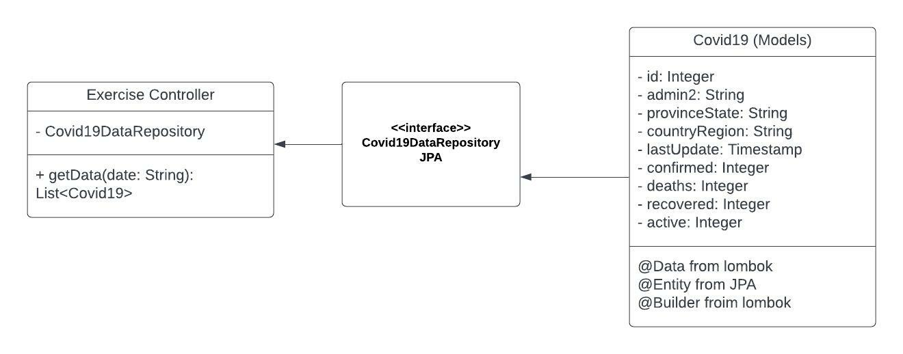

# Docs Summary

## Data Model

Explains the steps taken to choose data source and decide on data model  

## Package Structure

Displays the package structure of the project.  

## Class Diagram

## Flowchart

## Wireframe

Original design of the wireframe  

## Sample data

## Useful Spring Boot annotations

@Postconstruct = after all beans and stuff are created, run the following code
public void init(){
}

@Enable Swagger2
@Configuration

## Further developments 

- CRUD operation for DB
- automated data crawling at 6AM every day
  - using GitHub API
- add YAML file
